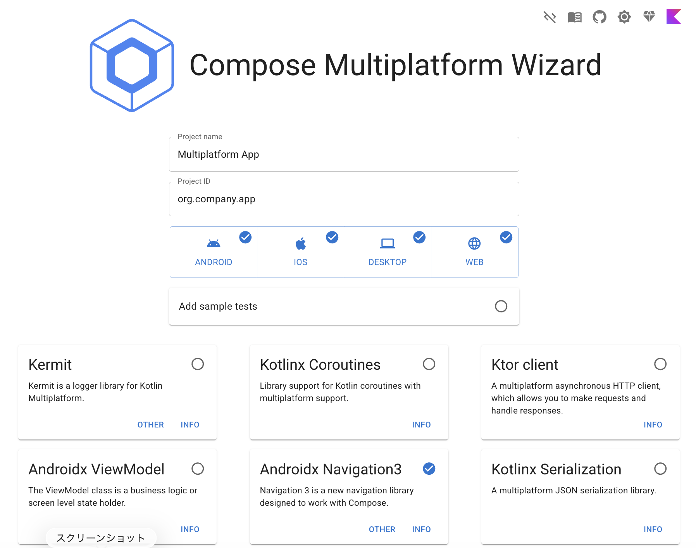

# Navigation 3 bottom tab example

<video src="./sample.mp4" >

Web sample: https://tbsten.github.io/Navigation-3-bottom-tab-example/

Navigation 3 での Bottom Navigation との統合のサンプル。

## Quick start with AI Agent

あなたのプロジェクトでも試したい場合は以下のステップに従ってください。

### 1-A. 新規プロジェクト

Compose Multiplatform Wizard を使って Compose Multiplatform のプロジェクトを作成してください。
Navigation 3 にチェックを入れるようにしましょう。



### 1-B. 既存プロジェクトへの追加

Navigation 3 の依存関係を追加してください。

参照 : https://kotlinlang.org/docs/multiplatform/compose-navigation-3.html

### 2. Agent skill を追加

```sh
npx skills add tbsten/skills --skill navigation3-main-tab
```

### 3. AI Agent に指示する

```
/navigation3-main-tab Home, ChatList, My Page の3つの下タブを実装
```

## vs. nav3-recipes

[android/nav3-recipes](https://github.com/android/nav3-recipes) は Google 公式の Navigation 3 レシピ集で、ボトムナビゲーションには **Multiple Back Stacks** パターンを採用しています。

| | nav3-recipes | このプロジェクト |
|---|---|---|
| バックスタック | タブごとに独立したバックスタック | 単一バックスタック + in-place 置換 |
| 戻るボタン | 現在タブ内を遡る | アプリ終了 or 非タブ画面へ戻る |
| タブ状態の保持 | スタック分離で自動保持 | Scene の固定 key で再利用 |
| タブ画面の特定 | ルートの型で判定 | `NavEntry.metadata` で判定 |
| 複雑度 | 高め (複数スタック管理) | 低め (単一スタック + SceneStrategy) |

**nav3-recipes が向いているケース**: 各タブ内で深い階層のナビゲーションがあり、タブ切り替え後も各タブの履歴を保持したい場合。

**このプロジェクトのアプローチが向いているケース**: タブはトップレベルの入り口で、タブ間の戻る操作が不要なシンプルな構成の場合。

## 参照

https://github.com/TBSten/skills/blob/main/skills/navigation3-main-tab.ja.md
